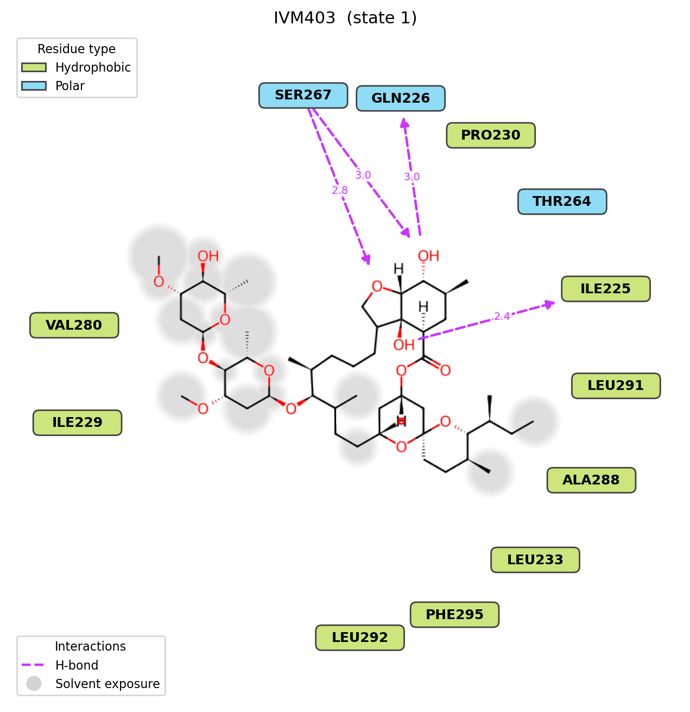
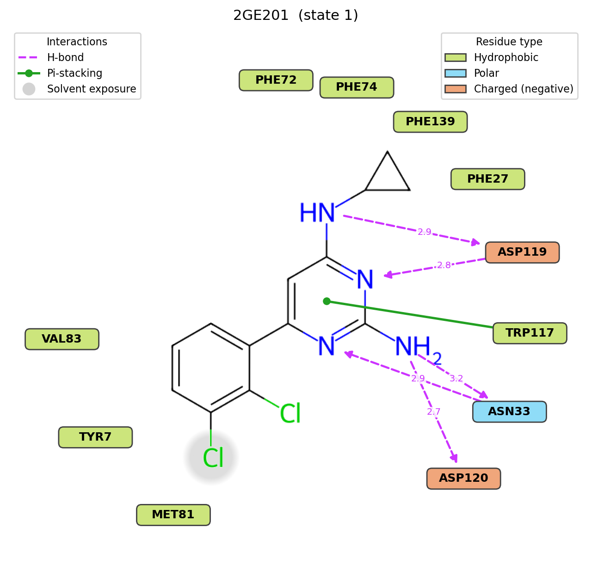
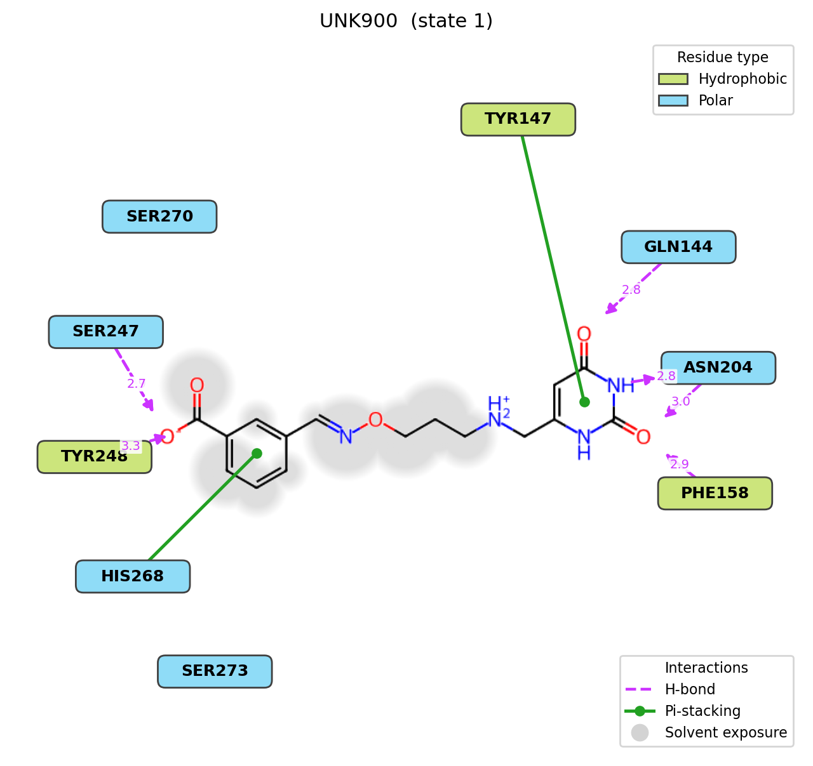

# Interaction2D v1.0

A PyMOL plugin that generates classic 2D protein-ligand interaction diagrams
(LigPlot/PoseView style): a real RDKit-drawn 2D structure of the ligand, with
contacting residues arranged as labeled nodes around it.

**Authors:** Evert J. Homan, PhD; Claude (Anthropic)
**License:** MIT

---

## Examples

| Ivermectin (5VDH, IVM403) | MTH1 inhibitor (4n1u, 2GE201) | 3FCI (UNK900) |
|---|---|---|
|  |  |  |

The second example shows a pi-stacking interaction (green line with a
circular end marker to TRP117) anchored on the ligand's aromatic ring
centroid rather than a single ring atom, plus grey solvent-exposure halos on
the two chlorine substituents and part of the pyrimidine ring. Node/line
colors are matched to a Schrodinger Maestro Ligand Interaction Diagram
(sampled directly from a Maestro-generated reference image of this same
ligand+structure) — see Features.

The third example (`3FCI.pdb`, checked against a Maestro reference
`3FCI_lid.png`) was used to validate H-bond detection against a fully
protonated structure (explicit H on *both* ligand and protein) and a
ligand with a charged carboxylate — see Notes for the two real detection
bugs this surfaced and fixed (a PyMOL mol-export bond-order artifact, and
protein hydrogens breaking the acceptor-direction geometry check).

---

## Features

- RDKit-based 2D depiction of the ligand — proper bonds, rings and
  stereo wedges, not a schematic network graph
- Automatic detection of:
  - **H-bonds** (N/O/S/F donor+acceptor pairs, ≤ 3.5 Å, filtered by a
    directionality check — see Notes) — magenta dashed line, distance
    labeled, arrowhead points donor → acceptor (away from the ligand when
    the ligand atom donates, toward it when the ligand atom accepts). The
    line stops short of the ligand atom at *whichever* end lands there —
    tip or tail — and short of the residue node, so it never overlaps
    either regardless of which one happens to carry the arrowhead. When a
    residue's label happens to land close to its own contact atom (a
    short H-bond distance doesn't imply the label is placed far away),
    the two pull-backs yield gracefully rather than collapsing the line
    to nothing — see Notes
  - **Salt bridges** (charged ligand N/O vs Arg/Lys/His/Asp/Glu side chains, ≤ 4.0 Å) — mauve dashed line, distance labeled
  - **Pi-stacking** (face-to-face & edge-to-face, ligand aromatic rings vs Phe/Tyr/Trp/His) — green line with circular end markers
  - **Hydrophobic contacts** (ligand C vs protein side-chain C, ≤ 4.0 Å) — no line drawn (matches Maestro), just the residue node colored green
  - **Solvent exposure** (per ligand atom): real relative-SASA (bound-complex
    SASA ÷ isolated-ligand SASA, via PyMOL's `get_area`) — grey halo behind
    atoms at or above 15% relative exposure
- Rounded-rectangle residue nodes colored by residue type: hydrophobic →
  green, polar → light blue, charged negative → orange, charged positive →
  purple-blue, glycine → cream, other → grey. Colors and interaction-line
  colors were sampled directly from a Maestro Ligand Interaction Diagram
  legend, not eyeballed.
- Pi-stacking lines emanate from the ligand aromatic ring's own 2D centroid,
  not a single ring atom
- Automatic radial layout of residue nodes around the ligand; node placement
  is derived from the actual rendered pixels (bonds, wedges, atom labels
  like "NH2"), so labels are pushed out far enough to never sit on top of
  ligand atoms, with collision avoidance between neighboring labels
- Residue-node angle is also chosen to keep H-bond/pi-stacking/salt-bridge
  connector lines from crossing the ligand's own drawing *or each other*,
  wherever a clear-enough angle is available nearby (not attempted for
  hydrophobic contacts, which don't draw a line at all — see Notes)
- Wedge/hash bonds are only drawn on genuine stereocenters — a spurious
  chiral tag from noisy 3D coordinates (e.g. a plain -CH2- can never
  really be chiral) is cleared before drawing, not just left to RDKit's
  raw 3D-geometry perception
- **Ligand picker** for structures with multiple ligands/copies — list
  candidates and pick one by index (CLI) or from a dropdown (GUI), instead
  of having to hand-write a precise selection string
- Live preview embedded in the plugin window; export to PNG/SVG

---

## Requirements

| Dependency | Notes |
|---|---|
| PyMOL ≥ 2.4 | Qt GUI required for the interactive window |
| [RDKit](https://www.rdkit.org/) | 2D depiction and ring/aromaticity perception |
| matplotlib | Rendering (QtAgg backend for the embedded preview) |

RDKit and matplotlib must be importable in the same Python environment PyMOL
runs in — check with `pymol -cq -d "run Interaction2D.py"`. If RDKit is
missing, both the GUI and `i2d_generate` report a clear error instead of
crashing.

---

## Installation

**Option A — Plugin Manager (recommended)**

`Plugin → Plugin Manager → Install New Plugin → choose Interaction2D.py`

Interaction2D then appears under the **Plugin** menu.

**Option B — run command**

```
PyMOL> run /path/to/Interaction2D.py
PyMOL> i2d_gui
```

---

## Quick start

1. Load a structure containing a protein and a bound ligand.
2. Open the GUI: `Plugin → Interaction2D` (or `i2d_gui`).
3. Set **Protein** (default `polymer.protein`) and **Ligand scope** (default
   `organic`) — this can be broad (matching several ligands/copies).
4. Click **Find** to list matching ligand residues in the **Ligand** dropdown,
   then pick the one you want to diagram.
5. Click **Generate**. The diagram appears in the preview pane with a status
   line (heavy atoms / residues / interactions found).
6. Click **Export…** to save the current diagram as PNG or SVG.

---

## GUI reference

| Control | Description |
|---|---|
| **Protein** | Editable dropdown, pre-populated with loaded objects that contain protein atoms. |
| **Ligand scope** | Any PyMOL selection string used to search for ligand residues (default `organic`). |
| **Find** | (Re-)scans the Ligand scope and populates the Ligand dropdown; runs automatically when the GUI opens. |
| **Ligand** | Dropdown of distinct `(chain, resn, resi)` residues found within the scope — pick the one to diagram. |
| **State** | Which state (docking pose) to use for multi-state ligand objects. |
| **Interactions** checkboxes | Toggle H-bonds / Hydrophobic / Pi-stacking / Salt bridges / Solvent exposure independently. |
| **Generate** | Runs detection and rendering for the selected Ligand entry, updates the preview. |
| **Export…** | Save the current figure as PNG or SVG. |

---

## CLI commands

```
i2d_list_ligands selection=organic, state=1
i2d_generate protein=polymer.protein, ligand=organic, ligand_index=None,
             state=1, filename="", hbond=1, hydrophobic=1, pipi=1, salt=1,
             solvent=1
i2d_gui                          Open the GUI
```

`i2d_list_ligands` prints every distinct `(chain, resn, resi)` residue found
in `selection`, indexed from 0. Pass that index to `i2d_generate` via
`ligand_index=N` to pick one without hand-writing a precise selection
string. If `ligand` already resolves to exactly one residue, `ligand_index`
can be omitted.

`i2d_generate` works without the GUI (including in headless `pymol -cq`
sessions) and returns the matplotlib figure object; pass `filename=` to save
directly.

---

## Notes

- Each diagram is for a single ligand residue — this is a single-ligand
  diagram tool, not a multi-pose viewer (see PoseViewer.py for stepping
  through docking poses in 3D). Use the ligand picker (GUI dropdown or
  `i2d_list_ligands`/`ligand_index`) to choose which one when a structure
  has several.
- Hydrophobic contacts are collapsed to one *residue node* (the closest
  qualifying atom pair determines the node's anchor position) — no line is
  drawn for them at all, only for H-bonds, salt bridges and pi-stacking.
- Residue node placement radius, in every direction, is
  `max(atom-center bounding radius, rendered-pixel content radius in that
  direction) + gap` — never smaller than a plain circular layout, only
  pushed further out where real drawn content (a wide atom label, a wedge)
  extends past it. This keeps labels off ligand atoms without the layout
  collapsing or crowding in sparse directions.
- Atom-to-pixel mapping relies on `cmd.get_model()` and RDKit's
  `Chem.MolFromMolFile()` producing identical atom ordering for the same
  selection/state — verified in this codebase, and cross-checked with an
  atom-count guard that raises a clear error if it ever doesn't hold.
- **H-bond arrow direction** (ligand donor vs. acceptor) is decided per
  contact: if the ligand atom has an explicit H (only present when the
  source structure/mol file has resolved or added hydrogens — not the
  common case for X-ray ligands) whose D-H...A angle actually points at
  the partner, that's used directly. Otherwise it falls back to RDKit's
  implicit valence (`GetTotalNumHs()`): an atom with no H at all (ether O,
  ester/carbonyl O, tertiary amine N, aromatic ring N) can only be an
  acceptor; an atom with at least one H is drawn as the donor, since real
  3D H geometry to decide otherwise isn't available for most ligands.
- **Protein-side H-bond geometry ignores protein hydrogens on purpose.**
  `_outward_ok`'s "away from covalent substituents" check needs the nearest
  *heavy* neighbor as a proxy for a protein atom's substituent bulk. If the
  source structure is pre-protonated (e.g. run through a PDB2PQR/Reduce-style
  prep pipeline — not unusual for docking/MD inputs), that atom's own H is
  almost always its closest neighbor (~1.0 Å vs ~1.5 Å+ to a real heavy
  atom), which would otherwise invert the check ("away from my own H"
  instead of "away from my heavy substituents") and silently reject real
  H-bonds donated through that H. `_nearest_neighbor_pos` explicitly
  excludes H when picking this proxy. Found via `3FCI.pdb` (fully
  protonated protein+ligand): GLN144's backbone N-H...O4 contact (a very
  short, textbook H-bond, N...O 2.79 Å) was being rejected before this fix.
- **Ligand mol-export bond-order repair**: a charged carboxylate whose two
  C-O crystal distances are close enough to be ambiguous can get *both*
  bonds guessed as double by PyMOL's bond-order perception (valence 5 on
  that carbon — RDKit sanitization then fails outright). `_build_ligand`
  retries once via `_fix_carboxylate_double_double`, which demotes the
  bond to whichever oxygen already carries the (correctly-assigned) -1
  formal charge back to single. Any other sanitization failure still
  surfaces the existing clear error rather than being silently patched.
- **Legend placement** picks whichever plot corner sits farthest from any
  ligand atom or residue node, rather than a fixed "lower left"/"lower
  right" — an elongated ligand can cluster several nodes into exactly the
  corner a fixed legend would occupy (seen on `3FCI.pdb`), silently
  hiding one behind the legend box.
- **Line-crossing avoidance also covers other H-bond/salt/pipi lines**, not
  just the ligand's own drawing — a residue's candidate angle is penalized
  for crossing a line already placed for an earlier residue in the same
  pass (`_segments_intersect`), so two lines don't visibly cross each
  other near the ligand.
- **H-bond arrow pull-backs never fully collapse a short line.** The
  box-edge distance (where the line actually crosses the residue box's
  boundary) is always honored exactly — shrinking it would leave the tip
  stopping short of the box with a visible dangling gap, worse than no
  pull-back at all. Only the small aesthetic margin beyond it, and the
  22px ligand-atom gap, flex down (together, proportionally) when the raw
  atom-to-node distance is too short for both at full size, always
  preserving at least `MIN_VISIBLE_ARROW_PX` (20px) of visible dashed
  line. The margin itself is skipped (0, not 6px) for whichever end is a
  plain tail rather than the arrowhead — a tail has no solid shape that
  needs clearing from under the box, and giving it a gap anyway just
  reads as a disconnected floating line, since (unlike an arrowhead) there's
  no shape there to visually bridge it.
- **Residue-node angular-wraparound fix**: the angular-spacing relaxation
  only checked *adjacent* pairs in sorted-angle order — two residues at,
  say, -177° and +178° are only ~5° apart on the actual circle but sort to
  opposite ends of the list, so they were never compared and could render
  with fully overlapping labels. Fixed by explicitly checking the
  wraparound pair (most-negative vs. most-positive angle) too. A second,
  independent safety net checks every *pair* of final node boxes for real
  rectangular overlap (not just angular gap) and pushes either one further
  out radially if still colliding — a fallback for any other layout
  scenario the angular relaxation alone doesn't cover.
- **Matches Maestro**: hydrophobic residues get no line to the ligand, only
  a colored node — proximity is implied by placement, not drawn explicitly.
  (Earlier versions of this plugin drew an explicit dotted line for
  hydrophobic contacts too, judged more informative; reverted once dense
  hydrophobic contact lines proved impossible to route without crossing the
  ligand often enough to be worse than not drawing them.)
- **Solvent exposure** clears PyMOL's `ignore` flag (used to exclude
  hetero/ligand atoms from area/surface calculations by default) on the
  ligand and protein atoms involved, as a side effect of computing SASA —
  harmless, but if you inspect those atoms' flags afterward in the same
  session, this is why. The "isolated ligand" SASA is computed on a genuinely
  separate temporary object (not just a narrower selection string), since
  `get_area` on a selection still lets other atoms in the *same* PyMOL object
  occlude it even if they're excluded from the selection.
- **H-bond geometry filter**: a plain heavy-atom distance cutoff flags some
  pairs that aren't real H-bonds (e.g. the far oxygen of a carboxylate
  pointing away from the ligand). Candidates are filtered by directionality:
  on the ligand side, if the atom has an explicit H (ligands are saved with
  hydrogens), the real donor H···acceptor angle is checked (≥100°); otherwise
  — and always on the protein side, which has no modeled H — the partner
  must lie roughly away from the atom's own covalent neighbor(s) (the
  lone-pair hemisphere) rather than behind it. This is a heuristic, not a
  full donor/acceptor model with idealized hydrogen placement (what tools
  like Maestro's Ligand Interaction Diagram do) — expect occasional
  differences from those tools, usually toward *fewer* false-positive
  H-bonds than a pure distance cutoff would give, not full agreement.
